# LEGO World & Character Builder

A dependency-free WebGL app for procedural LEGO-style worlds, editable minifigures, and third-person exploration.

Open `dist/index.html` in a browser with WebGL. No installation or build service is required.

This repository contains **saved project version 68**, imported from source commit `62e199d551ba31fab4306fdddca67b15214ae824`. The release number and JSON save-format number are separate: this release writes save format **4**. Later engine-style scene-editor changes are not included in this snapshot.

## Brick Worlds engine (work in progress)

This repository is being grown into **Brick Worlds Engine** following the build plan (phases P0–P8). Phases 0–7 are in place.

- **`dist/editor.html` — the Brick Worlds editor (Phases 1–7).** **Start here (P7):** the first time it opens, the **Start hub** makes a complete game in one click (theme, quest, length, maps, seed — the same seed always makes the same game) and plays it, or **Watch it being built** replays the generator stage by stage (name, terrain, maps, gates, hero, props, logic, screens, cinematic, audio, world UI, check), opening each stage's workspace with what it did and how you would do it yourself. The **guided tutorial** (Help › Guided tutorial) walks through every workspace and tool on a sandbox project in 10 chapters and 51 steps: each step spotlights a control, **Show me** has a demo pointer do it and then puts everything back so you repeat it, **Do it for me**, Skip and Back always work. The **Help guide (F1)** has a page per workspace, a 12-step *Build a game from scratch*, the logic reference generated from the node catalog (`docs/logic-reference.md`), every shortcut and limit, troubleshooting and search. A Scene editor on the new project format: menus, workspace tabs, tools (select, move, rotate, brick paint, place asset, color paint, erase, spawn points), hierarchy/layers/find, inspector, the v68 terrain generator, a bottom dock, Game / Walkable views, undo for everything, IndexedDB autosave, `.bwproj` files. **Assets** (P3): houses, trees, cars… are asset files placed as instances (the generator output is unchanged, checked against v68 for every environment), a built-in library plus interactive props (chest, door, lamp post, stall, signpost), and the **Asset studio** (build plate, states, sockets, interactions, smash and generator rules). **Characters** (P3): v68's presets and routines as data files, and the **Character studio** (look, gear, emotes, keyframe timeline with event and sound markers). **Play (F5)** runs the game inside the editor on the new engine runtime (fixed 60 Hz steps; pause, single step, 0.25–2× speed; E uses chests and doors, keys 1–4 play emotes; a Debug tab with watch values, collider/spawn drawing and cheats); Stop discards everything that happened while playing. The **World graph** workspace connects maps by dragging between spawn points and checks routes. **Logic** (P4): game rules as node graphs or as script (a strict JavaScript subset, CodeMirror), in sync both ways and side by side; events (start, zones, interact, smash, rebuild, variables, timers, custom), flow (branch, wait, once, gates, for-each), variables, world actions; trigger zones (Z); breakpoints that pause Play and show values. **Audio** (P5): named sound events (random / sequence / shuffle, pitch range, cooldown, voice limits), music states with crossfades and stingers, a mixer with live meters and ducking, sound emitters (S) and music / ambience zones, imported .wav/.mp3/.ogg/.m4a stored by SHA-256, and a generated CC0 sound pack so smashing, rebuilding, jumping, footsteps, gates, chests, doors and menus all make sound. **Screens** (P5): splash, title, HUD, pause, dialogue and game-over screens as JSON (1280×720 reference, anchors, `{variable}` bindings, hearts, bars, lists, dialogue, minimap), edited on desktop/phone/tablet frames; Play shows the HUD, Esc opens Pause (F5 stops), losing every heart shows Game over, **Play from first screen (Ctrl F5)** boots splash → title → game; world UI signs (U) show bound text over the 3D view. **Cinematics** (P6): the **Director** workspace directs a scene like a film shoot — cast the hero, neighbours or any character, drop marks and record walks by clicking the stage, place cameras from the view (cuts or eased blends, follow and look-at), and add dialogue, gestures, clips, music, sounds, fades, titles, slow motion and logic events on a multitrack timeline (snapping, waveforms, a preview through the active camera). Scenes play in the game with letterbox and Skip (Esc), and are started by zones, asset interactions, screen buttons, gate arrivals (World graph), clip markers or logic (`docs/cinematic-tracks.md`). **Play in v68 (F6)** keeps the v68 runtime for guns, magic, powers and the volcano; **v68 studio** opens v68 for paint/photo looks and neighbors and brings the edits back as one undo step. See `docs/parity-checklist.md`.
- `dist/index.html` is still LEGO World v68, byte for byte. Its sources live in `src/legacy/` (unchanged); `npm run build:legacy` (or `python3 assemble.py`) rebuilds it.
- `src/core/` is the typed engine core (no DOM): Zod schemas, lossless v1–v4 migration into the v5 layout (one folder per map, 32×32-stud chunk files, characters, gates), `ProjectStore`, `CommandBus`, autosave, v68's layout rules. `src/engine/render/` is the WebGL renderer (v68 geometry and shaders, chunked and instanced); `src/engine/runtime/` is the play runtime (fixed-step loop, `PlaySession` on a project snapshot, interactions and actions, play renderer with v68's character models); `src/engine/character/` plays keyframe clips (animator); `src/core/logic/` is the logic node catalog, graph checks and the code dialect (print/parse); `src/engine/logic/` compiles graphs and runs them in Play; `src/engine/audio/` is the audio engine (mixer, ducking, 32-voice pool, sound events, music director) and `src/engine/ui/` the screen renderer, screen stack and world UI; `src/engine/cinematic/` the deterministic cinematic player (nav-grid paths, camera rig, tracks) and `src/engine/systems/cinematic.ts` runs scenes in Play; `src/core/media/` imports media (SHA-256, probing, limits); `src/core/gamegen/` generates whole games as replayable command stages; `src/editor/start/`, `src/editor/tutorial/` (data-driven steps in `content/*.json`) and `src/editor/help/` (pages in `docs/help/*.md`) are the P7 onboarding; `src/builtin/` holds the built-in assets, characters, clips, screens and the generated audio pack (`src/builtin/audio`, see its CREDITS.md); `src/builtin/` holds the built-in assets, characters and clips (regenerate with `node scripts/extract-assets.mjs` and `node scripts/extract-characters.mjs`). `src/editor/` is the Preact UI.
- `dist/engine.html` is v68 plus a host that keeps a v5 copy of the world in IndexedDB (Phase 0).

```sh
npm ci
npm run build          # dist/index.html (v68), dist/editor.html (editor), dist/engine.html
npm run serve          # http://localhost:8000/editor.html (or /index.html, /engine.html)
npm run check:fast     # lint, typecheck, module rules, unit tests (~40 s)
node scripts/gen-logic-reference.mjs   # regenerate docs/logic-reference.md after changing logic nodes
npm run test:legacy    # the 34 v68 suites, in parallel (--shard 1/4 for CI shards)
npm run test:e2e       # Playwright (set PW_CHROMIUM_PATH to use a preinstalled Chromium)
npm run check          # everything CI runs
```

## Quick start

```sh
git clone https://github.com/garciaraul85/lego-world.git
cd lego-world
python3 -m http.server 8000 --directory dist
```

Open <http://localhost:8000>, or open `dist/index.html` directly. No Three.js, backend, external asset packs, or npm installation is needed to play. Python is optional for serving/building; Node.js is only needed for syntax checks/tests. Browser autosaves belong to the page's origin, so use Save/Load to transfer a project between URLs.

### Guide contents

- [Screenshot tour](#screenshot-tour)
- [Connected maps](#connected-maps)
- [Character studio](#character-studio)
- [Building scale](#building-scale)
- [Artwork and photos](#artwork-and-photos)
- [Controls](#controls)
- [Weapon combat](#weapon-combat)
- [Architecture and every source module](#architecture-and-every-source-module)
- [Assembly and development workflow](#assembly-and-development-workflow)
- [Startup, frame loop, and rendering](#startup-frame-loop-and-rendering)
- [Brick and procedural-world internals](#brick-and-procedural-world-internals)
- [Character rig, animation, and collision](#character-rig-animation-and-collision)
- [Destruction, rebuilding, and effects](#destruction-rebuilding-and-effects)
- [Artwork and NPC internals](#artwork-and-npc-internals)
- [Map loading and caching](#map-loading-and-caching)
- [Save format and undo](#save-format-and-undo)
- [Action API and extension recipes](#action-api-and-extension-recipes)
- [Tests and troubleshooting](#tests-and-troubleshooting)

## Screenshot tour

Actual version 68 captures show the application controls and 3D viewport. Desktop images show the whole application page; mobile workshop images include the scrollable controls. Example scenes are not bundled saved projects.

### Character studio

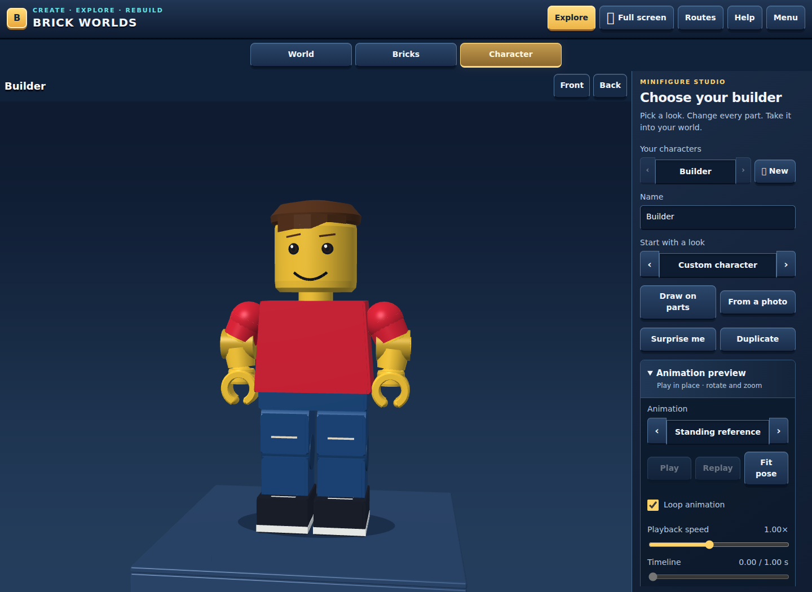

### World workshop

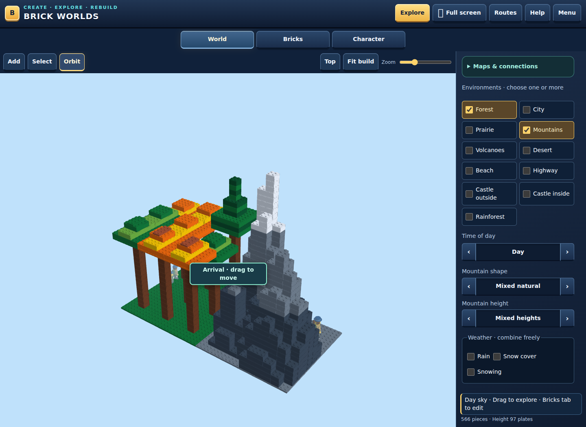

### Brick workshop

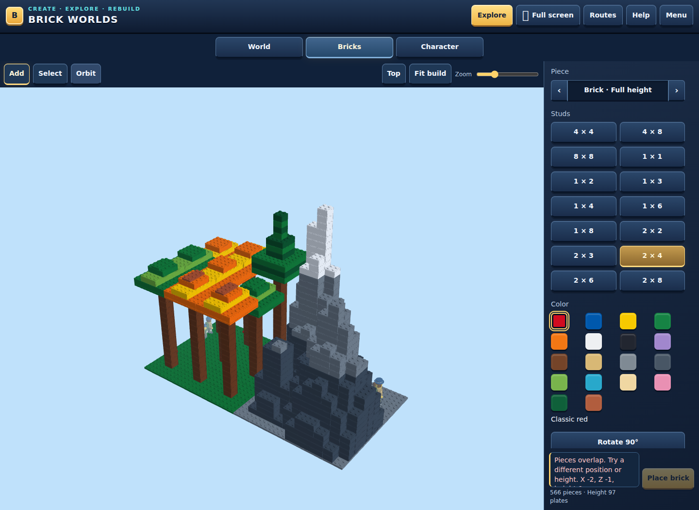

<details>
<summary>All other screens: animations, drawing, photos, maps, routes, play, help, saves, and mobile</summary>

### In-place animation preview

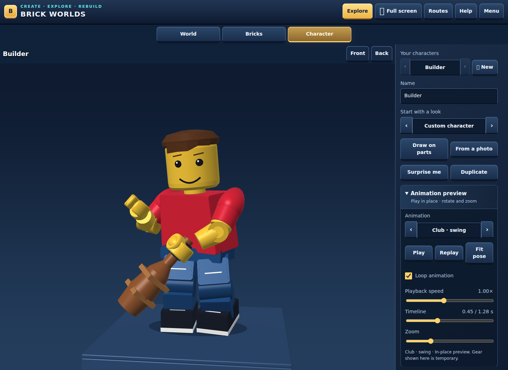

### Part drawing

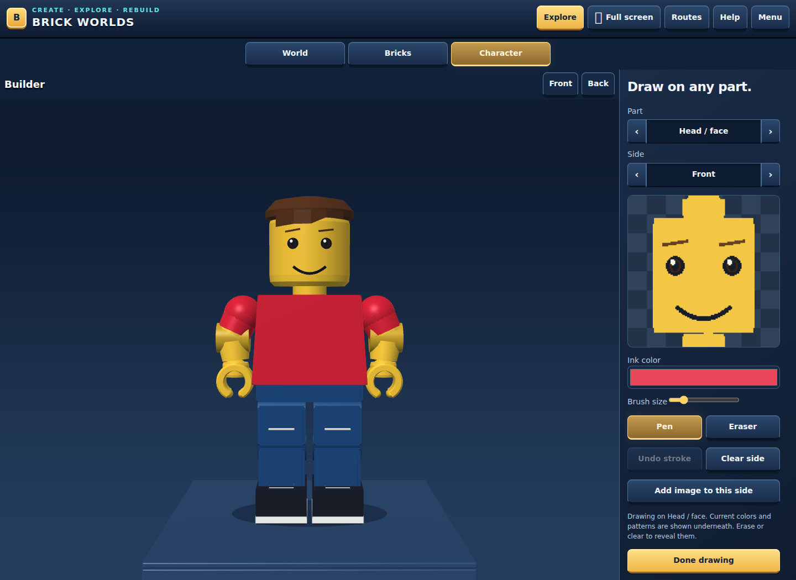

### Photo import

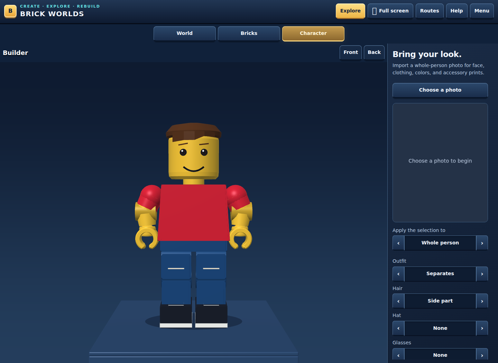

### Map and spawn settings

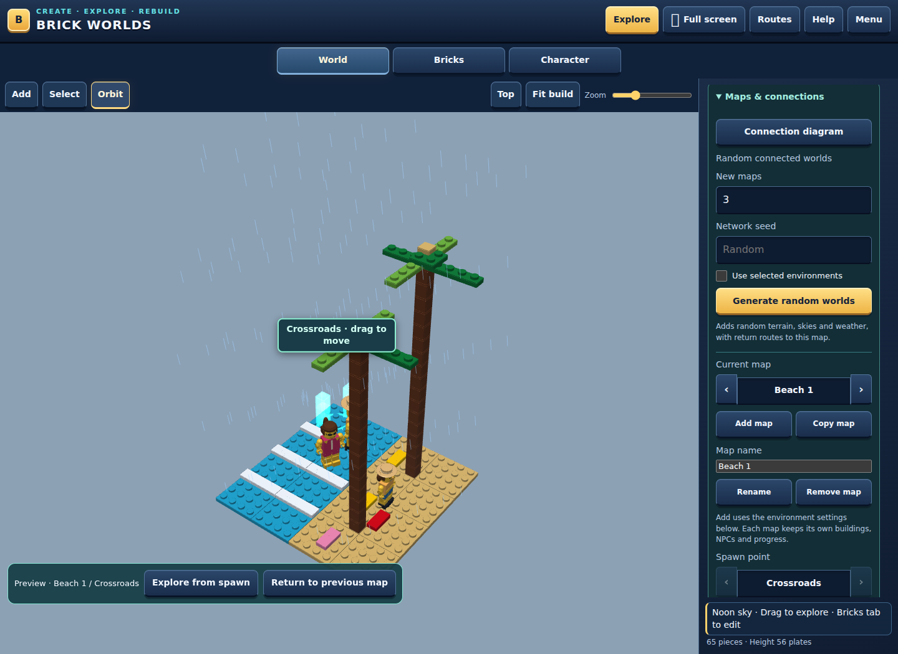

### Route diagram

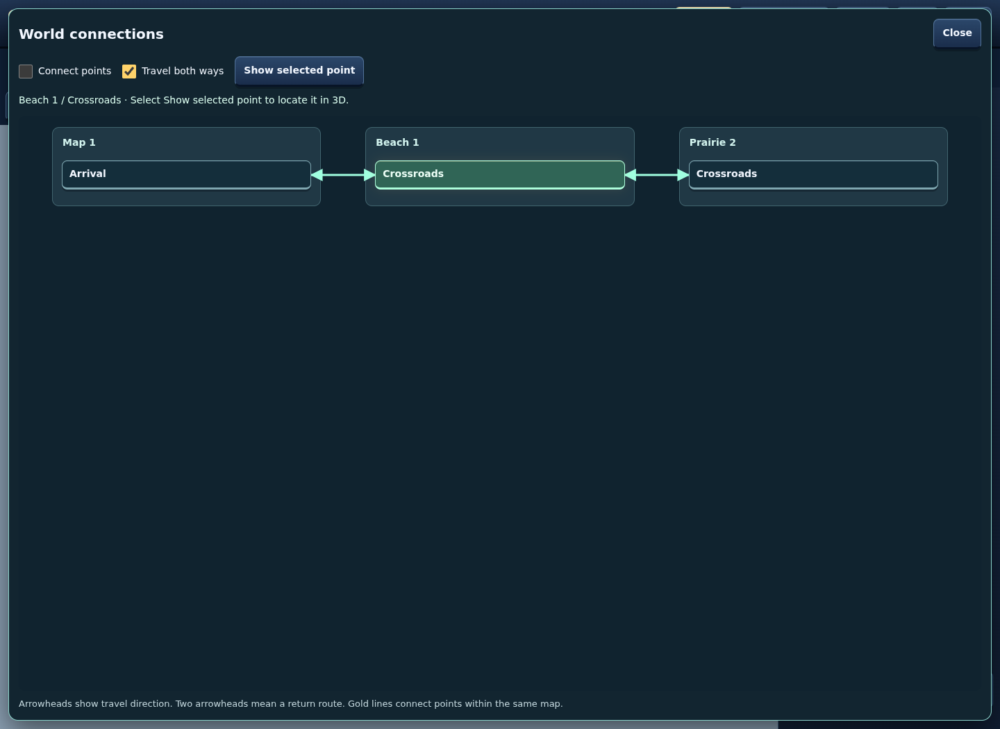

### Exploration

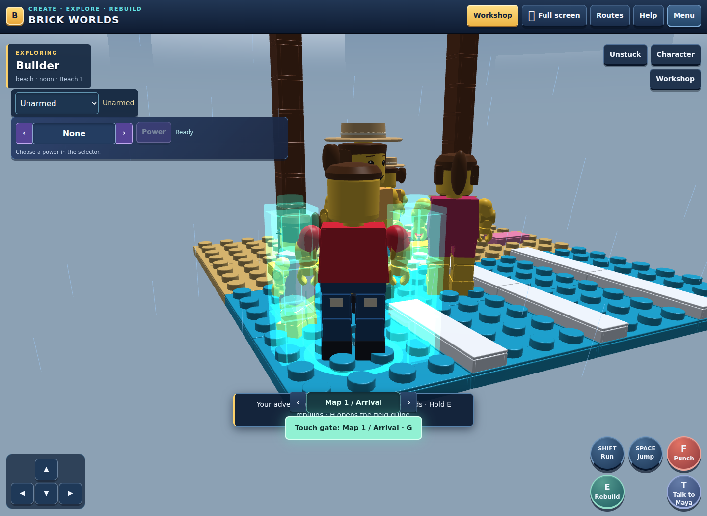

### Field guide

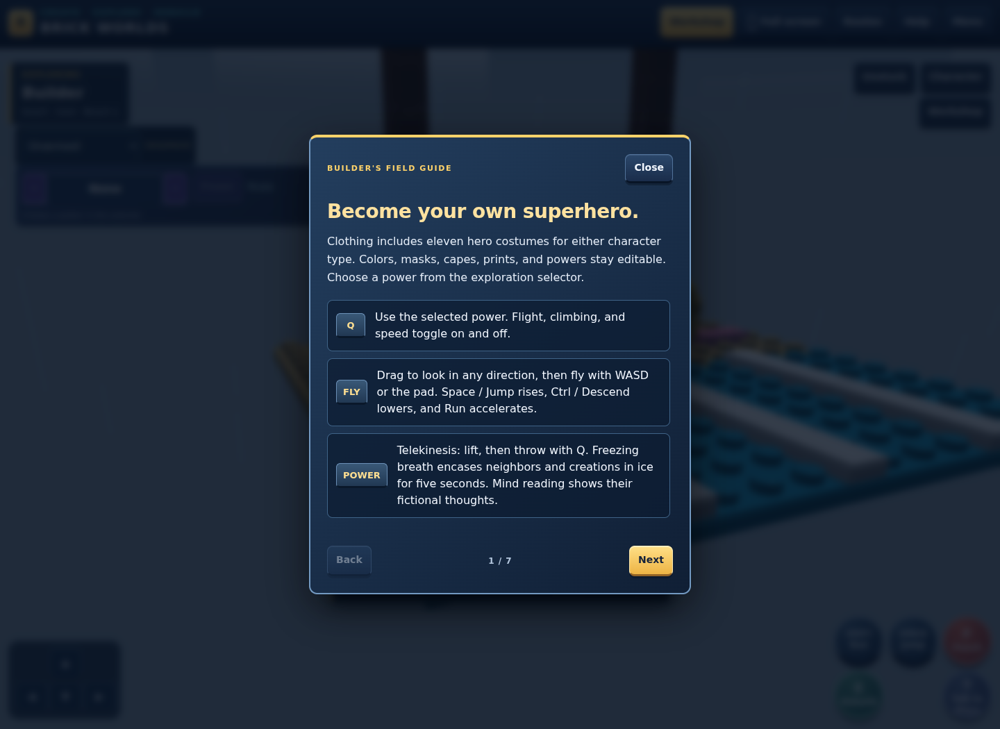

### Save/export dialog

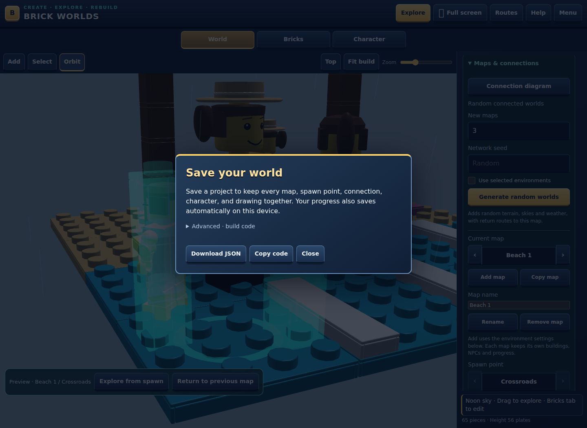

### Mobile workshop

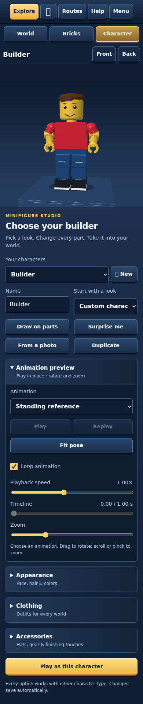

### Mobile exploration

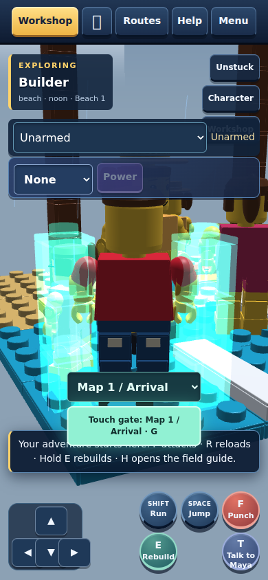

### Mobile landscape exploration

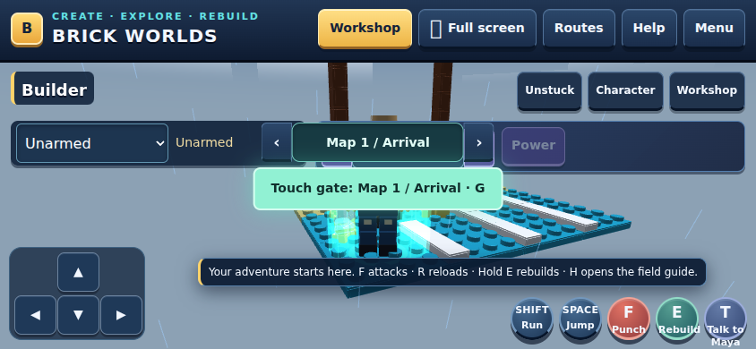

</details>

See [screenshot capture instructions](docs/screenshots/README.md) to regenerate the gallery.

## Connected maps

Open World → Maps & connections. Select environments and use Add map to create another map, or Copy map to duplicate the selected map. A project supports 16 maps, each with its own terrain, sky/weather, player position, NPCs and smashed objects; character appearances are shared. Generate replaces only the selected map. Save/Open and device autosave include the entire collection, while older single-world saves open as Map 1.

Random connected worlds creates 2–15 additional maps in one batch, subject to the 16-map project limit. Leave Network seed blank for a surprise, or enter a seed to reproduce the same terrain, weather, NPCs and routes. Use selected environments restricts the pool to the environment checkboxes; otherwise all environments are eligible. Map size follows the World size selector. Maps receive shuffled primary environments, unique terrain seeds, varied skies/weather and safe Crossroads spawn points. A spanning tree and occasional extra routes connect every generated map to the selected existing spawn with travel in both directions. Generation opens a preview; existing maps stay intact, and Undo removes the entire batch. `node tests/legacy/random-worlds.cjs` covers reachability, seed reproduction, native controls, safe travel, capacity, project persistence and atomic undo.

Every map starts with an Arrival point. Add named spawn points and use Place on map to tap open terrain, or Use player position to reuse the explorer's location. Choose another map and arrival point, enable Travel both ways for a return route, and connect. The network cards and connection rows preview either endpoint in 3D; Return goes back, and Explore from spawn tests the arrival.

Connected points glow cyan. Touch a connected gate while exploring to teleport automatically; G or Travel also activates a nearby route. Gates with multiple nearby connections offer a destination selector. Arrivals check the complete character rig against scenery and neighbors, move old edge points inside the boundary, and recover blocked or destroyed arrival ground using nearby or alternate supported ground. Travel renders the destination immediately and suppresses immediate return travel. On touchscreens the Travel button activates when pressed, so running cannot move out of range before release. `node tests/legacy/travel.cjs` checks a formerly failing saved edge gate, destination render batches/sky/HUD, safe arrival and touch press/release. Removing a point or map also removes its connections; Undo restores the change. `node tests/legacy/maps.cjs` checks persistence, compatibility, validation, preview, routes, travel and collection undo.

## Character studio

Choose Characters, edit a preset or create a custom character, then select Explore. The collection stores up to 24 editable characters. Appearance, clothes, colors, expressions, hats and gear update the 3D preview immediately. Save / Open exports or restores the full project, including the character collection, player position and smashed objects. Version 1–3 projects remain supported. Female profiles include editable breast size and rounded, natural or angular contours on the toy torso.

The model uses chamfered molded edges, tapered arm segments, rounded hip joints, smoother head and hair meshes, a hollow head stud and two-sided cape/wings. The torso widens toward the hips, shoulder joints connect to the torso, hand size matches the proportions, and short hair has a shaped fringe. Elbow and knee hinges separate upper arms/forearms and thighs/shins. Walking, running, jumping and smashing bend the joints; clothing and prints split at each hinge, shoes follow the shin and held items stay intact in the hand. A supporting foot stays planted during grounded movement. Jumps blend through reaching arms, tucked knees at the apex, extended legs during descent, and a planted landing crouch. A short edge grace period and buffered jump input make jumps more forgiving. Unarmed hits close both hands, keep the elbow tucked, drive the knuckles straight forward and retract into guard without a sideways sweep. Hits use restrained body motion and recovery. Held tools follow a controlled outward arc and stay clear of the head and torso; objects break at contact, and leaving exploration or respawning cancels a pending hit. Prints use the same surface coordinates in both the drawing editor and the 3D preview.

Height in Appearance offers Very short (70%), Short (85%), Regular (100%), Taller than average (112%), and Tall (125%). The whole articulated figure and equipment scale together; collision boxes, effects, projectiles, and preview framing follow the chosen height. Heights save with characters and neighbors. Existing characters default to Regular.

## Building scale

New city worlds use larger street districts, 10 × 8 stud houses, and 8 × 10 stud skyscrapers with 6–10 storeys. Rooms have 7.2 studs of headroom and four-stud entrances. Castles have larger courtyards, towers, gates, and halls. All buildings remain editable and destructible brick assemblies. Existing worlds retain their pieces and boundaries; use World → Generate to create the larger buildings, or Undo to restore the previous world. Layout versions preserve both old and new district dimensions when saving or importing.

Forest trees now have 12–18 brick trunk layers and eight-stud canopies; rainforest trees have 20–28 trunk layers, and beach palms have 12–18 layers and broad fronds. Regenerate an existing world to use the larger trees.

The sky projects the sun, moon, stars, and clouds from world directions using the actual camera orientation and lens. Sun and moon orbit over a twenty-minute sandbox day, with lighting and sky colors following their elevation. The time-of-day selector sets the starting time. Roads use seamless asphalt surfaces and clipped paint for lane markings; markings have no collision or brick pieces. Saved highway marking tiles remain in the save data but render and collide as paint.

## Artwork and photos

Draw on parts opens a pen/eraser canvas for each character part and its six sides. The canvas shows the actual part colors and patterns beneath your ink, including facial prints and clothing detail. Select a part, draw, undo strokes, clear one side or import an image. Erase and Clear reveal the original asset appearance. Strokes update the 3D character during drawing. Completed strokes are backed up automatically, and Done commits any unfinished stroke, saves the character and confirms the result. Transparent PNG artwork follows the part in 3D and is included in project exports. Missing accessories are added when chosen for painting.

From a photo processes PNG, JPEG or WebP locally. Crop to a person to transfer a palette and stylized face, clothes, shoes and selected gear prints, or crop one item and apply it to a chosen part. Select matching outfit, hair and accessory shapes; the importer does not infer 3D geometry from photos. Images stay on the device. Large artwork can exceed browser storage; Save downloads a project that includes the artwork.

Random neighbors spawn safely around each world and wander nearby. Approach a neighbor and press T or Talk. Select a topic or type a question about the world, weather, controls or rebuilding. Dialogue is generated locally from preset responses. Saved projects retain the neighbors.

## Controls

- WASD or arrows: walk relative to the camera.
- Shift: run.
- Space: jump.
- F: smash an object within reach.
- Hold E: rebuild nearby smashed pieces into their original assembly.
- Drag: orbit the camera; wheel or pinch: zoom.
- T: talk to a nearby neighbor.
- G: travel through a nearby connected spawn point.
- Escape: close conversation or exit exploration.

On touchscreens, use the directional pad and Run, Jump, Smash, and Hold to rebuild buttons. Hold Run while pressing Jump for a running jump; the buttons accept separate touch pointers. Respawn returns the character to a safe point. Foundations are protected; above-ground pieces can break. Loose bricks keep falling and bouncing until they rest flat on the ground or another brick. They continue settling outside exploration and after loading a saved world, and fall again if their support is smashed. Rebuilding rejects new edits that obstruct the original assembly.

## Source and checks

`world-generator.js` generates connected brick worlds. `character-catalog.js` defines validated editable assets and presets. `character-model.js` builds and animates minifigure geometry. `game-physics.js` handles collision and movement. `character-game.js` connects the studio and gameplay to the existing editor. `character-art.js` and `character-art-ui.js` provide paint atlases and local photo processing. `npc-world.js` and `npc-ui.js` provide wandering neighbors and dialogue. `builder.js` hosts the renderer, editor and project storage.

After editing files in `src/legacy/`, run `npm run build:legacy` (or `python3 assemble.py`) to update the self-contained app; it also syntax-checks the assembled script. Tree, celestial-camera and road checks: `node tests/legacy/trees-sky-roads.cjs`. Scale and entrance checks: `node tests/legacy/scale-and-buildings.cjs`. Functional checks: `node tests/legacy/world.cjs` `node tests/legacy/characters.cjs`, `node tests/legacy/art-and-neighbors.cjs` `node tests/legacy/art-inputs.cjs` `node tests/legacy/joints.cjs` `node tests/legacy/debris.cjs` and `node tests/legacy/actions.cjs`. The checks exercise the application's public action tools, geometry generation, project compatibility, physics, destruction and exact restoration.

Independent LEGO-style builder; not an official LEGO product.

## Weapon combat
- Equip from the Explore weapon selector or Accessories → Held item. Medieval: club, mace, war hammer, sword, battle axe, flintlock pistol and musket. Modern: baton, bat, crowbar, sledgehammer, handgun, revolver, SMG, rifle and shotgun. Existing hammer, wrench and shovel also have swing animations.
- F / Attack strikes or fires; hold F / Fire for the SMG and rifle. R / Reload refills a firearm from unlimited sandbox reserves. Run and Jump remain independent touch controls. While standing with a firearm, drag the camera to face the shot direction.
- Joint-connected windup, impact and recovery; supported long-gun stance, recoil, slide/pump cycling, and hand/magazine reload movement. Projectiles use swept first-hit collision, including barrel obstruction and terrain, and expire at world borders. Destruction restores exact original pieces through the existing rebuild system. Ammunition is per character and weapon during the session; equipment remains in saved character profiles.
- `node tests/legacy/weapons.cjs` checks weapon rigs, hit timing, occlusion, range, ammo/reload and independent touch actions.

## Architecture and every source module

The app has one root (`#brick-builder`) and one main WebGL canvas (`#bb-canvas`). World editing, character preview, and exploration share project data and rendering. Drawing/photo tools also use 2D canvases. Geometry, shaders, camera math, rigging, physics, and UI are implemented in plain JavaScript.

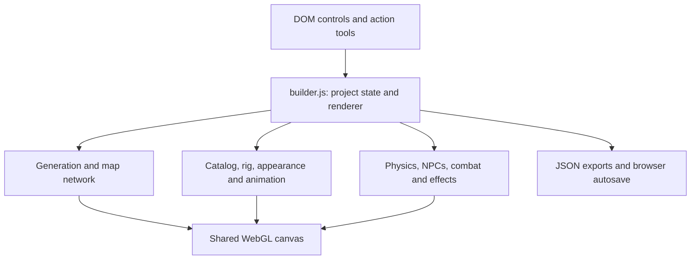

Some scripts declare IIFE-based module objects (`WorldGenerator`, `GamePhysics`, `CharacterModel`, etc.). Others are inserted **inside the builder closure** and intentionally refer to its local state. They are not ES modules: loading them individually or changing assembly order requires adapting their dependencies.

All files below are in `src/legacy/` unless a path says otherwise.

| File | Responsibility |
| --- | --- |
| `assemble.py` | Ordered script/style assembly and expansion of builder insertion markers. |
| `dist/index.html` | Runnable self-contained app (build output). Markup and base stylesheet live in `src/legacy/shell.html`. |
| `builder.js` | Pieces, placement/selection, validation, camera/WebGL, history, project storage, generation, action registration, and frame scheduling. |
| `game-ui.css` | Game chrome, panels, controls, overlays, and responsive styles. |
| `game-ui.js` | Game pickers, navigation, help/system overlays, and UI synchronization. |
| `game-screen.js` | Screen/viewport/orientation measurement, layout attributes, fullscreen, and input cancellation on screen changes. |
| `world-generator.js` | Seeded biome validation/generation, connected brick terrain, buildings, trees, mountains, roads, and groups. |
| `world-sky.js` | World-relative sun/moon directions and sky/lighting colors across a 20-minute sandbox day. |
| `volcano-simulation.js` | Volcano phase timing, finite smoke/ash/blast/lava particles and their bounded motion. |
| `volcano-effects.js` | Active-world vent discovery, surface queries, simulation, and volcano rendering integration. |
| `connected-worlds.js` | Validates/generates a complete seeded map batch, safe NPCs/arrivals, and a connected route network before applying it. |
| `map-network.js` | Per-map snapshots, validation, switching, preview, links, arrival checks, teleport detection, and map tools. |
| `spawn-editor.js` | Spawn placement, position/facing controls, clearance feedback, and interactive SVG route diagram. |
| `character-catalog.js` | Presets/defaults, choices/colors/ranges, height scales, paintable slots, and profile validation. |
| `character-model.js` | Procedural character/gear meshes, print atlases, GPU caches, rig matrices, limb solving, attachments, and collision binding. |
| `rig-collision.js` | Compound transformed part boxes, oriented contact tests, and limb clearance corrections. |
| `game-physics.js` | World bounds/spatial bins, movement, gravity/jump/landing, actor/scenery contacts, spawning, camera clearance, rebuild safety, and debris settling. |
| `character-game.js` | Roster/editor bindings, studio/play transitions, controller, destruction/rebuild/debris, and character action tools. |
| `character-art.js` | Image/palette sampling, stylization, and image-processing helpers. |
| `character-art-ui.js` | Drawing strokes/atlases/live textures, part/side selection, local file/crop handling, and photo mapping. |
| `npc-world.js` | Seeded neighbors, biome-associated roles, wandering/controller state, serialization, and local dialogue rules. |
| `npc-ui.js` | Nearby NPC selection/conversation, topic buttons/input, and neighbor actions. |
| `game-weapons.js` | Weapon definitions, physical/timing parameters, motion keyframes, projectile casts, and world-edge queries. |
| `weapon-game.js` | Equipment/ammo, strikes/fire/reload/spell state machines, impacts, destruction, and combat effects. |
| `game-magic.js` | Spell definitions, patterned trails/bursts, palettes, lifetimes, and bounded particle motion. |
| `super-powers.js` | Power/costume catalogs, costume-to-profile mapping, and green-construct definitions. |
| `hero-game.js` | Powered movement/actions, freezing/laser/strength/telekinesis/claw effects, and transient power state. |
| `studio-motion.js` | Procedural yoga/exercise/fighting/kicking and sports routines. |
| `studio-animations.js` | Unified preview catalog and clip/time sampling into temporary profile/pose state. |
| `studio-preview.js` | Playback/pause/replay/scrubbing/loop/speed controls and preview effects. |
| `studio-props.js` | Temporary exercise/sports props for studio routines. |
| `tests/legacy/*.cjs` | Node VM fixtures/assertions against the assembled app, geometry, state, and action APIs. |
| `.openai/hosting.json` | Original static-host configuration; not required for local play. |

## Assembly and development workflow

`scripts/inline-html.mjs --legacy` (what `assemble.py` now calls) is a concatenator, not a transpiler. It reads `src/legacy/shell.html`, inserts `game-ui.css` between the `GAME_UI_START`/`GAME_UI_END` markers, fills the script with the ordered sources listed in `scripts/legacy-manifest.mjs`, syntax-checks it, and writes `dist/index.html`.

```sh
npm run build:legacy   # same as: python3 assemble.py
```

Change controls/markup in `src/legacy/shell.html`; change game CSS in `src/legacy/game-ui.css`; change behavior in the source modules. Reassemble before tests/publishing because the tests execute the assembled HTML. `tests/unit/legacy-build.test.ts` fails if `dist/index.html` is out of date.

Assembly first adds world/volcano/sky, magic/power/weapon/studio, character catalog, rig/physics, model/art/NPC, and connected-world module declarations, then the builder closure. Inside builder it expands:

- `/* MAP_NETWORK */`: `map-network.js` and `spawn-editor.js`.
- `/* VOLCANO_WORLD */`: `volcano-effects.js`.
- `/* CHARACTER_GAME */`: character gameplay, weapons/powers, studio props/preview, art/NPC UI, and game UI/screen scripts.

Dependencies determine this order. For example, preview clip generation reads the weapon/spell catalogs, and character geometry/collision uses catalog and rig definitions. The repository does not have a package.json-based runtime build pipeline.

## Startup, frame loop, and rendering

1. Initialize root/canvas, editor state, shader programs, buffers, catalogs, and control bindings.
2. Attempt to load `lego-free-build-v1` from localStorage. Validate pieces/profiles/world/NPC/damage/map data before restoring it.
3. Register optional host tools if `document.modelContext.registerTool` exists; ordinary browsers do not require it.
4. Generate the forest/mountains default (`seed: 73521`) when no saved build exists. Synchronize the character studio and maps, then draw.
5. Schedule `requestAnimationFrame`. Cap elapsed frame time at 0.05 seconds and skip simulation work when the document is hidden.

The loop advances clock/volcanoes, then studio playback or gameplay. Exploration updates inputs, player movement, attack/fire/spell timing, powers, debris, NPCs, gate travel, and held rebuilding. Position autosaves periodically. Touring, changing sky, weather, and changing state mark the scene dirty.

`dirty` gates drawing; `renderRevision` invalidates scene-dependent caches. `draw()` measures canvas bounds, caps device pixel ratio at 2, sets camera/projection, and renders sky, terrain/roads, NPCs, studio/player, debris/effects, rebuild guidance, portals, selection, and placement ghost as applicable.

The renderer constructs its own box/cylinder/chamfered geometry, shaders, matrices, lighting, fog, snow tint, and print textures. Brick meshes are reused by size/type. World instances are batched; `ANGLE_instanced_arrays` accelerates repeated pieces where available, with a regular drawing fallback. The sky shader uses the camera basis to project world-space celestial directions. Roads use asphalt surfaces/paint; legacy highway marking tiles are omitted from normal brick rendering/collision where applicable.

## Brick and procedural-world internals

A piece has `id`, `rows`, `cols`, `kind`, `color`, `turn`, `x`, `y`, `z`, and optionally `group` for an assembly. X/Z coordinates and dimensions use whole studs. Stored Y uses **plate heights**; physics/rendering multiply by 0.4. Bricks are 3 plates tall; plates/tiles are 1. Rotation `turn` is 0–3 quarter-turns, with footprint dimensions swapped on odd values.

`validatePiece()` checks supported dimensions/type/color, rotation, integer coordinates, and bounds. `inspect()` fills occupied cells, records top/bottom stud surfaces, builds an adjacency graph, and traverses from ground-level pieces. It rejects overlap/disconnected assemblies; tiles have no top studs. Ghost checks disable invalid placement. Deleting supports is rejected if it disconnects remaining pieces. `commit()` records history, replaces pieces, invalidates physics/rendering, persists, and updates UI.

`WorldGenerator.generate()` uses deterministic seeded random values and terrain hashes. Chosen biomes occupy districts in a near-square arrangement; placement helpers track occupancy/surfaces and emit supported brick sizes/group IDs. Biomes include forest, city, prairie, mountains, volcanoes, desert, beach, highway, castle outside/inside, and rainforest. Mountain configurations include mixed/alpine/ridges/rolling/plateau shapes and mixed/low/medium/high scales.

Size 16/24/32 is a generator setting, not always the final map width: city/castle structures require larger districts. Metadata retains final dimensions, regions, config, and layoutVersion. Saved older layouts remain supported; regeneration uses the newer scale.

SkyCycle samples a 1,200-second day from the selected starting time. VolcanoSimulation has a 46-second venting/pressure/eruption/cooling/quiet cycle. Its transient particles expire, remain bounded, and settle/fall as terrain support changes; it is not a fluid simulation that replaces saved editable terrain.

## Character rig, animation, and collision

CharacterCatalog validates plain profiles for all appearance/clothing/body/color/equipment/paint fields. The roster supports up to 24 characters. Height scales the entire rig, attachments, collision/effects, and preview framing (70%, 85%, 100%, 112%, 125%).

CharacterModel builds renderable parts with local geometry/bounds, paint slots, and joint ownership. The rig includes torso/hips/head, upper arms/forearms/palms, thighs/shins/feet, and accessories. Elbow/knee geometry and prints split at the hinges. Pose functions blend movement, jump/landing, building, combat, and powered state into joint matrices. Combat includes hip/body rotation and limb endpoint/bend-plane solving. Rigid palm/tool attachments remove limb stretch so the object follows the grip without stretching with the forearm.

This is a procedural rig, not an imported skeleton/animation pack. StudioAnimations samples clip/time into temporary profile/pose overrides; StudioMotion supplies yoga/exercise/fighting/sports routines and studio props. Pause/replay/loop/speed/scrub work without moving an exploration controller. Preview gear is temporary; it does not replace saved character equipment.

GamePhysics.Controller indexes brick bounds into four-stud spatial bins and tests nearby scenery/actors. For bound characters, RigCollision transforms local part bounds by the model matrices. It rejects disjoint axis-aligned extents, then uses separating-axis tests on compound oriented boxes. Locomotion uses core body/leg parts; arm clearance corrections are separate, so a long held weapon does not enlarge one whole-body radius. Utility controllers without a rig use a lightweight cylinder fallback. These are bounding-volume contacts, not triangle-level skin collision.

Controllers slide around contacts, resolve floors/ceilings, apply gravity, and increase substeps with movement distance/time to reduce tunneling. Buffered jumps and a short coyote window tolerate early/late presses. NPC state references update obstacles as neighbors move. Generated world boundaries remain fixed after destruction; free builds derive bounds from ground pieces. Camera clearance queries reduce scenery intrusion.

## Destruction, rebuilding, and effects

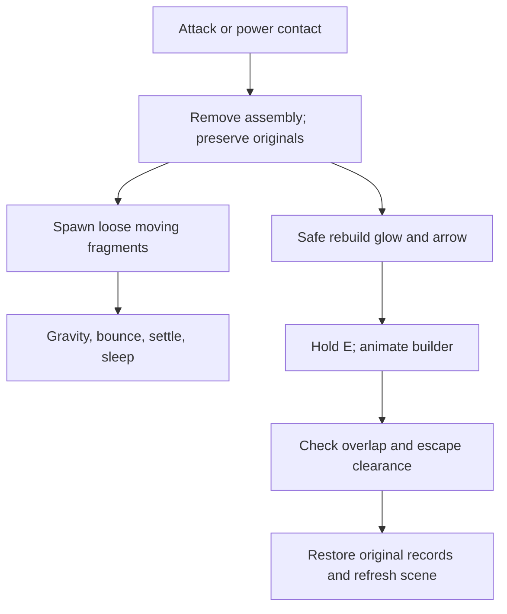

Groups identify generated assemblies. Breaking stores exact records in `broken[].originals` and removes the visible pieces; protected foundations remain. Debris has velocity/orientation/gravity, support checks, bounce/settling, and sleeping. Unsupported fragments wake/fall again, including outside exploration and after saved damage reload.

Rebuilding finds a safe spot, shows a glow/arrow, drives the builder animation/progress, and restores the recorded original pieces. It rejects new overlaps/obstructions and compares reachable ground before/after to avoid trapping the character. Restoration is not re-running the random generator.

GameWeapons.catalog supplies weapon reach, mass/inertia, duration/contact, pose keyframes, grip/tip/edge and firearm/reload parameters. weapon-game.js runs attack/recoil/ammo/reload state machines. Melee strike points/edges and projectiles use swept checks; the first obstruction takes contact, including barrel obstruction. Ammo is session state per character/weapon; sandbox reserve ammunition is unlimited.

The wand casts Ember Burst, Frost Bloom, Arcane Spiral, Thunder Bolt, Verdant Vortex, and Prism Nova. GameMagic selects palettes, ember/snowflake/spiral/lightning/vortex/prism patterns, speed/range/radius/impulse, trails/bursts/lifetimes, and bounded particle motion. Damage enters the existing destruction/rebuild path.

SuperPowers maps costumes to editable profiles and defines flight, strength, laser eyes, freezing breath, climbing, super jump/speed, green constructs, telekinesis, mind reading, and claws. hero-game.js executes movement/effects/transient state. Freezing temporarily encases affected NPCs/scenery; green constructs choose generated shapes; claws use strike poses. Mind reading uses local generated/preset text. These are sandbox mechanics, not a campaign/progression system.

## Artwork and NPC internals

Paintable parts use a **384 × 256 atlas**: six 128 × 128 faces in a 3 × 2 arrangement. The 2D editor displays the selected face enlarged, compositing current appearance/patterns underneath transparent editable ink. `appearanceAtlas()` supplies base appearance; erase/clear reveals it. Strokes upload live texture changes, completed strokes persist, and Done commits an unfinished stroke. Stroke history and project-level undo are separate. Paint is serialized as PNG data URLs in the profile.

Photo import reads PNG/JPEG/WebP files under 20 MB using FileReader/Image and local canvases. Users crop a person/item and choose matching procedural outfit/hair/gear shapes. Image sampling/stylization transfers palette/prints to head, torso, limbs, shoes, and accessories. It does not reconstruct 3D geometry or use remote recognition; the app uploads no photos. Large image data can exhaust autosave quota, so export JSON.

NPCWorld uses world seeds/regions to choose biome-related roles/presets and supported open spawn positions. Neighbors wander using controllers/home positions and share actor collision references with the player. npc-ui.js selects nearby neighbors and opens topic/typed conversation. Responses are local rules/presets; there is no remote chatbot or multiplayer server. NPC profiles/state are map-specific saved data.

## Map loading and caching

The project supports 1–16 maps, 1–32 named spawn points per map, and up to 256 total connections. Characters are shared. Pieces, world settings/weather, damage, NPCs, and saved player position belong to each map. Endpoints are `{ mapId, spawnId }`; links store `from`, `to`, `twoWay`. Two-way links permit return travel; one-way links permit only the outgoing direction. Different points on the same map can connect.

Spawn placement raycasts a visible top surface, snaps the proposal, checks floor/body/NPC clearance, and shows valid/invalid feedback. Coordinate/facing controls and handles refine it. The diagram shows labeled endpoints/directional arrows and supports selecting/connecting/previewing points. Removal cleans dependent links; project Undo can restore them.

Gate detection checks player motion segments as well as nearby points. Touching a connected gate automatically travels; G/Travel explicitly activates it and multiple nearby routes expose a destination selector. Switching snapshots the old map, restores destination payload, rebuilds active physics/NPCs, finds a safe supported arrival, invalidates caches, and immediately draws. Arrival locks suppress instant return travel until the player clears the gate. Preview retains a return location.

ConnectedWorlds generates 2–15 additional maps within capacity using one network seed. A spanning tree establishes reachability and extra routes add variety. Each map gets individual terrain seeds, varied settings, NPCs, and safe arrivals. The complete batch validates before mutation and is one undoable action.

### Are all worlds loaded?

All maps' **serialized data** stays in memory and is included in the project export/autosave. Only the active map supplies scene drawing batches, terrain spatial index, active NPC controllers, and current effects. Map changes do not fetch an asset pack: geometry is procedural and scripts loaded with the page.

Shared caches reuse brick meshes, active instance batches, character geometry (up to 32 profile signatures), paint textures (up to 80 entries), and temporary preview profiles. Revision keys rebuild stale scene/road/support queries. The app does not render every map simultaneously or unload every inactive map's saved data.

## Save format and undo

Exports use `format: "brick-builder"`, `version: 4`. Top-level fields represent the active map for compatibility; `maps` stores the collection and inactive payloads. The active nested map `build` is null in an export because its content is already at the root.

| Field | Meaning |
| --- | --- |
| `pieces` | Editable connected brick records for active map. |
| `world` | Generated config, dimensions, layoutVersion; null for a free build. |
| `environment` | Starting/current time selection and rain/snow/snowing flags. |
| `characters` | Shared roster `items` with IDs/profiles and `activeId`. |
| `player` | Saved active player position/heading; runtime motion is normalized on load. |
| `npcs` | Active-map NPC profiles and serialized state. |
| `broken` | Damage entries with IDs and exact original pieces. |
| `maps` | Active/next IDs, maps with names/spawns/payloads, and endpoint links. |

The parser supports formats 1–4, validates IDs/connectivity/profiles/world/link endpoints/bounds, normalizes legacy data, and rejects nested map collections. It limits JSON text to about 64 MB and active-plus-damaged IDs to 12,000 pieces per map. Use an exported app save as a fixture; empty rosters/spawn arrays are not valid collection saves.

History snapshots the full project before mutations, clears redo, and caps history at 12 for worlds/multi-map projects or 80 for free builds. Restore recreates appropriate runtime/render state. Autosave uses historical key `lego-free-build-v1`, which does **not** mean save format 1. Save exports/copies JSON; Load validates text/file data. Live particles, preview playback, and ammunition are transient rather than full simulation save state.

## Action API and extension recipes

If a host supplies `document.modelContext.registerTool`, the app registers actions tied to a lifecycle AbortController. Actions call the same code as UI controls; this is optional host integration, not a REST API or public `window.game` object.

| Action | Purpose |
| --- | --- |
| `read_brick_build` | Read project data. |
| `place_bricks` | Validate/place a batch of up to 1,000 connected pieces. |
| `move_brick` | Atomically move/rotate an existing piece. |
| `generate_lego_world` | Replace current map using validated environment/weather/seed settings. |
| `configure_lego_character` | Apply validated preset/profile changes and show the studio. |
| `explore_lego_world` | Start/stop play. |
| `control_lego_character` | Step movement, jump, attack, rebuild, equipment, and power inputs. |
| `manage_lego_maps` | Read/create/copy/switch/preview maps, manage spawns/routes, travel, or generate a connected batch. |

NPC actions are defined in `registerNPCTools()` in npc-ui.js. Inspect each registration's inputSchema for exact accepted fields. The VM tests capture tools into a Map and call `execute(input)` directly. Invalid catalog/placement/map inputs throw; batch generation/placement validate before committing.

Example generator input:

```json
{ "biomes": ["forest", "mountains"], "time": "day", "rain": false, "snow": false, "snowing": false, "size": 24, "seed": 73521 }
```

| Extension | Start here | Also update/check |
| --- | --- | --- |
| Biome/constructed asset | world-generator.js | Supported piece dimensions/connectivity, groups/districts/bounds, NPC roles, generator tests. |
| Appearance option | character-catalog.js | Model geometry/prints, UI visibility, old-save defaults and validation. |
| Held weapon | game-weapons.js | Catalog/model geometry, grip/tip, body/arm/hand pose, attack/fire/reload behavior, clearance tests. |
| Spell | game-magic.js | Selection, pattern/impact, finite lifetime, particles and bounds. |
| Power/costume | super-powers.js | hero-game execution, pose/effects/UI, saved fields versus transient state. |
| Preview routine | studio-motion/animations | Duration/sampling, temporary props, in-place root, preview tests. |
| Map behavior | map-network/spawn-editor | Parser/export, safe arrivals, same-map routes, diagram and undo. |
| New control | dist/index.html + relevant UI module | Unique ID, responsive CSS, keyboard/touch handling, then reassemble. |
| Save schema | builder + profile/map parsers | Compatibility/defaults, validation, round-trip and migration tests. |

Use catalog validation/shared rig transforms instead of independent special-case attachment/collision approximations. Rebuild the HTML and run relevant tests after source changes. The screen module measures root/window/visual viewport/orientation/coarse pointers, adjusts layout/fullscreen state, accounts for editing/onscreen-keyboard changes, and cancels held inputs when layout changes. Mobile workshop scrolling differs from bounded exploration. Touch movement/action buttons track independent pointers, enabling Run+Jump together.

## Tests and troubleshooting

Tests use Node's built-in assert/vm with DOM/WebGL stubs and execute the assembled app. They assert geometry, validated catalogs, controller state, save round trips, and public action behavior. They do **not** prove real shader compilation/pixels/CSS/device usability; inspect those in a real browser.

Focused checks (no npm dependencies needed):

```sh
node tests/legacy/world.cjs
node tests/legacy/maps.cjs
node tests/legacy/random-worlds.cjs
node tests/legacy/spawn-editor.cjs
node tests/legacy/touch-teleports.cjs
node tests/legacy/rig-collision.cjs
node tests/legacy/studio-preview.cjs
node tests/legacy/screen.cjs
```

| Coverage | Tests under `tests/` (`.cjs`) |
| --- | --- |
| Terrain/building scale/sky/roads/volcanoes | world, scale-and-buildings, trees-sky-roads, foliage-volcano-clothing, mountains-volcanoes |
| Maps/diagrams/arrivals/touch gates | maps, random-worlds, spawn-editor, travel, touch-teleports |
| Profiles/joints/art | characters, joints, art-and-neighbors, art-inputs, printed-chest-art, nipple-details |
| Movement/collision/damage/rebuild | actions, collision, npc-collision, rig-collision, debris, motion-bounds, rebuilding |
| Combat/powers/attachments | weapons, magic, superheroes, weapon-visibility, arm-clearance, club-arms, club-clearance, warhammer-clearance |
| Game UI/screen/preview | game-ui, screen, studio-preview |

Run everything sequentially when appropriate; large catalog/scene checks can take longer:

```sh
for test in tests/*.cjs; do node "$test" || exit 1; done
```

| Symptom | Check |
| --- | --- |
| Source changes do not show | Reassemble and open the rebuilt dist/index.html. |
| Blank canvas | Console/context/shader errors, WebGL/hardware acceleration, canvas dimensions, old autosave. |
| Different build on another URL | Autosave origin differs; transfer JSON with Save/Load. |
| Artwork does not autosave | Storage quota; export JSON before clearing data. |
| Cannot place/delete | Occupancy/stud connectivity; selected piece may support others. |
| Cannot travel/rebuild | Gate range/routes/arrival clearance or new rebuild obstruction/escape safety. |
| Slower large scenes | Biome count/scale, geometry/prints/particles, GPU, map-data and undo memory. |

The app is a local sandbox: no accounts, cloud synchronization, multiplayer server, remote NPC AI, or photo-based 3D reconstruction. It is not an official LEGO product.
